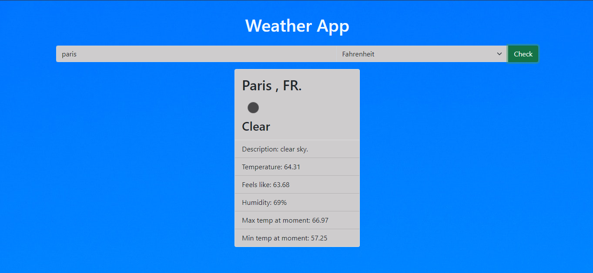
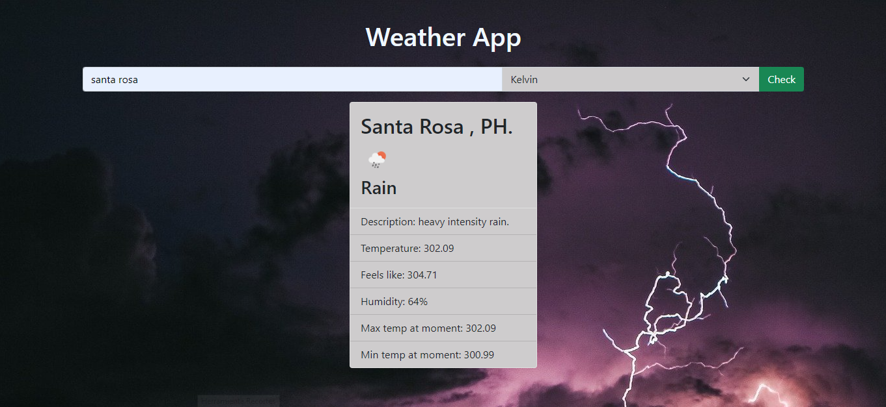

# Weather App

> A simple weather forecast site using the weather API from [Open Weather](https://openweathermap.org/)

## Built With

- HTML5
- CSS3
- Bootstrap
- JavaScript
- Webpack

## Live Demo

[Live Demo Link](https://rocio01.github.io/weather-app/)

## Getting Started

To get a local copy up and running follow these simple example steps.

### Setup and Install

- Clone this repository using the link above (click on the 'code' button)
- Open a terminal and `cd` to the cloned repository
- run `npm install`
- run `npm run build`
- run`npm run start` to open a live server in your preferred browser.

### Usage

- Enter the city name, choose the temperature unit and click the check button.
- If you want to change the temperature unit, select another unit and then click the check button.

### Deployment

- Deployed on GitHub Pages

## Author

👤  **Rocio Martinez** 
- Github: [@Rocio01](https://github.com/Rocio01) 
- Twitter: [@rugiada8801](https://twitter.com/rugiada8801) 
- Linkedin: [zulma-rocio-martinez](https://www.linkedin.com/in/zulma-rocio-martinez) 

## 🤝 Contributing

Contributions, issues, and feature requests are welcome!

Feel free to check the [issues page](https://github.com/Rocio01/weather-app/issues).

## Show your support

Give a ⭐️ if you like this project!

## Acknowledgments

- [The Odin Project](https://www.theodinproject.com/paths/full-stack-ruby-on-rails/courses/javascript/lessons/restaurant-page)

## 📝 License
